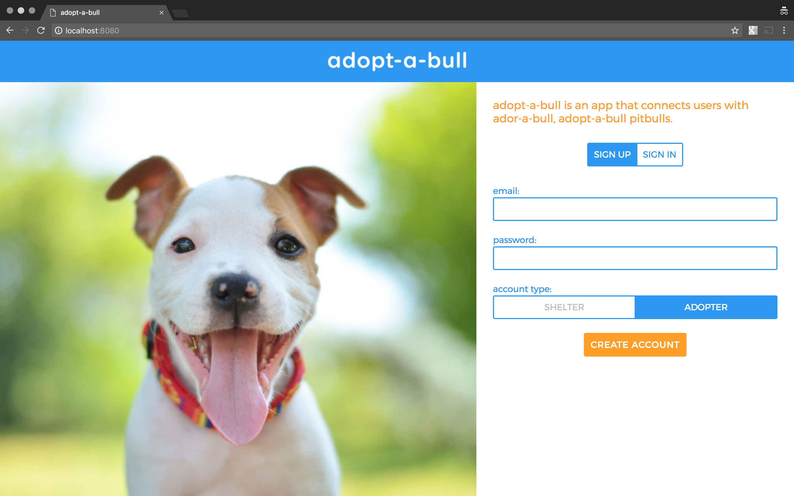
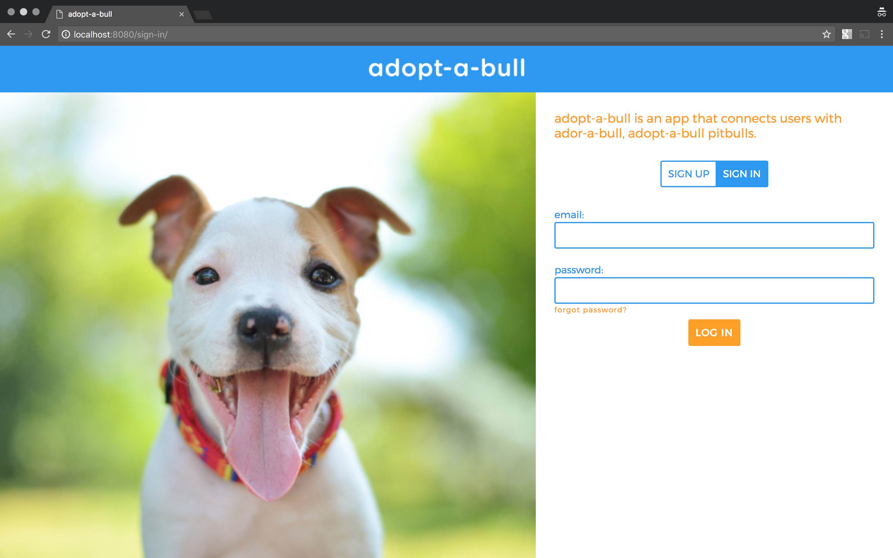
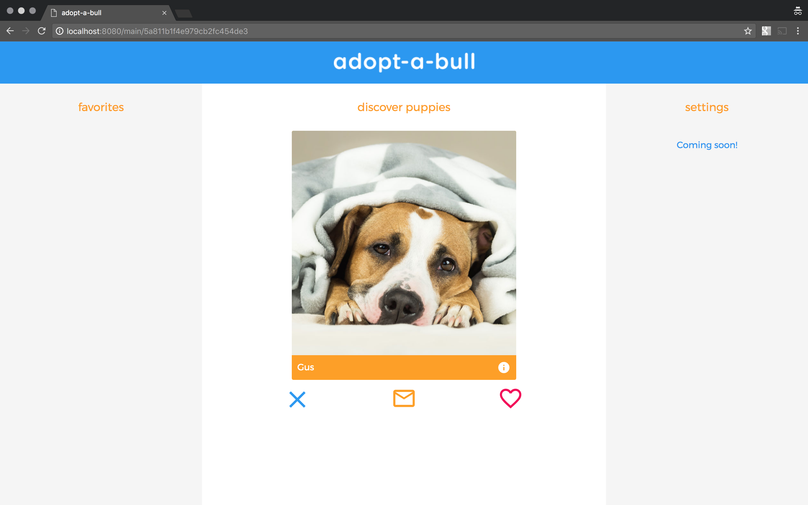
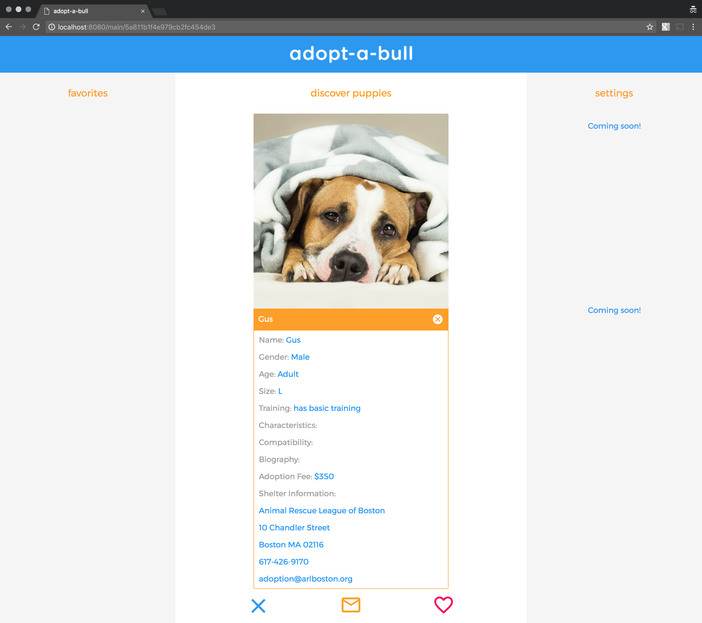
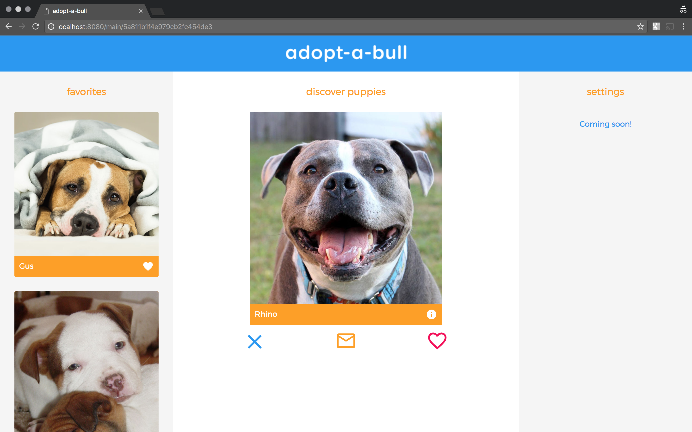

# adopt-a-bull

  [adopt-a-bull](https://react-adopt-a-bull.netlify.com/) is a react app that connects users with ador-a-bull, adopt-a-bull pitbulls. 

  *demo adopter email: demo-adopter@gmail.com*  
  *demo adopter password: Password123*  

  *demo shelter email: demo-shelter@gmail.com*  
  *demo shelter password: Password123*  

  ## v1

  allows adopters to:  
   - sign up for an account  
   - sign in  
   - browse adopt-a-bull puppies  
   - 'next' a puppy  
   - 'favorite' a puppy  
   - contact a shelter about a puppy  
   - view their list of favorited puppies  
   - reset password
   - log out
   - delete account
  
  allows shelters to:
   - sign up for an account
   - sign in
   - enter and update the shelter's contact information  
   - submit a form to add an adopt-a-bull puppy to the database  
   - view the shelter's list of adopt-a-bull puppies
   - reset password
   - log out
   - delete account
  
  ## v2

  will add support for shelters to:  
    - edit an adopt-a-bull puppy  
    - remove an adopt-a-bull puppy  
   
   will add support for adopters to:  
    - edit their list of favorited puppies
    - enable their location  
    - filter adopt-a-bull puppies by distance  
    - filter adopt-a-bull puppies by attributes

  

  

  

  

  